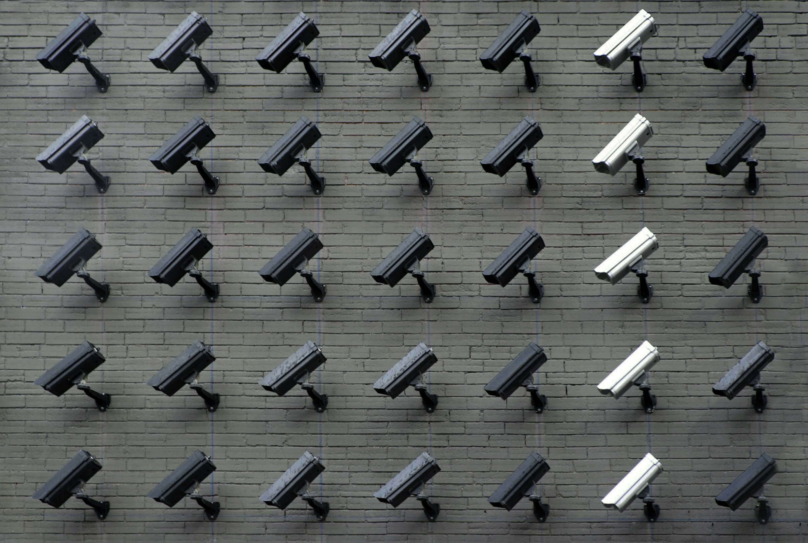
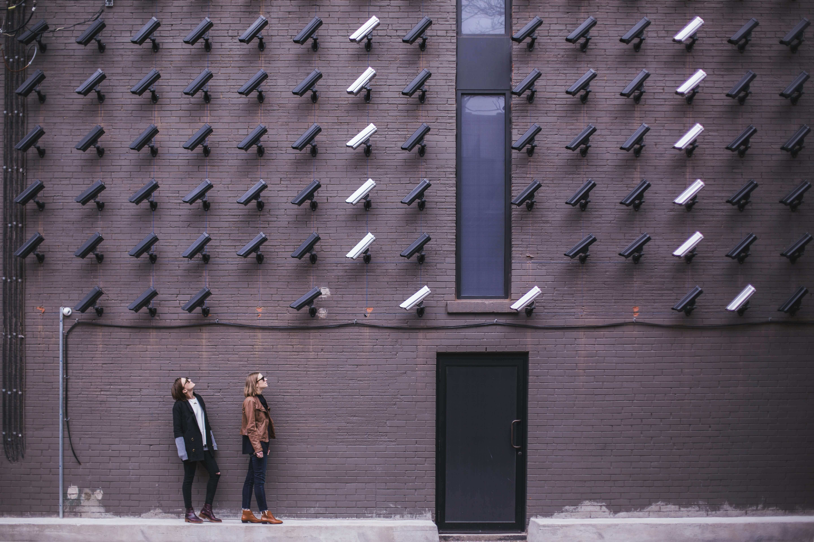

So, you’ve got nothing to hide. That’s great! You’re a law-abiding, upstanding citizen who pays their taxes, recycles diligently, and always remembers to feed the cat. But here’s the thing: privacy isn’t just about hiding things—it’s about protecting your choices, your autonomy, and your right to control your own life.

Let’s break it down in a way that might make you think twice.

## Privacy is Like Your Underwear
Yes, you read that right. Privacy is like your underwear. You’re not necessarily hiding anything scandalous, but that doesn’t mean you want to show it off to everyone. It’s personal, it’s yours, and it’s not anyone else’s business unless you decide otherwise.

Now, imagine if someone demanded to see your underwear every time you walked into a store. You’d probably feel uncomfortable, right? That’s how it feels when companies, governments, or even strangers online demand access to your personal information. Just because you’re not hiding anything doesn’t mean you want to hand over the keys to your life.

## The “Nothing to Hide” Myth
The “I’ve got nothing to hide” argument sounds reasonable at first, but let’s flip it around. If you’ve got nothing to hide, would you be okay with:

A stranger reading all your text messages?

Your boss knowing every website you’ve ever visited?

A company tracking your location 24/7 and selling that data to advertisers?

Suddenly, it feels a little different, doesn’t it? Privacy isn’t about hiding wrongdoing—it’s about maintaining boundaries and protecting your personal space.

## Why Privacy Matters (Even for the Good Guys)
Here are a few reasons why privacy should matter to you, even if you’re not a secret spy or a fugitive on the run:

### 1. Your Information Can Be Used Against You
Think about all the data you generate every day: your search history, your location, your shopping habits, even your fitness tracker data. In the wrong hands, this information can be used to manipulate you, discriminate against you, or even steal your identity.

For example:

Insurance companies might raise your rates based on your fitness tracker data.

Employers might reject your job application because of something they found online.

Scammers might use your personal information to trick you into giving them money.

### 2. Privacy Protects Your Freedom
Privacy is the foundation of freedom. Without it, you’re constantly being watched, judged, and influenced. Imagine if every decision you made—what to buy, where to go, who to vote for—was influenced by someone who knew everything about you. That’s not freedom; that’s surveillance.

### 3. You Deserve Control Over Your Own Life
Privacy is about control. It’s about deciding who gets to know what about you and when. Just because you’re not doing anything wrong doesn’t mean you should give up that control.

But Wait, There’s More!
Still not convinced? Let’s play a quick game. Imagine this:

You’re at a coffee shop, and the barista asks for your Social Security number to process your latte order.

You’re walking down the street, and a stranger stops you to ask for your bank account details.

You’d probably say no, right? That’s because some information is private—not because you’re hiding something, but because it’s yours.

Now, think about all the data you hand over online without a second thought. Every time you click “I agree” on a terms-and-conditions page, you’re essentially giving away pieces of your privacy. And unlike the nosy barista or the stranger on the street, the companies collecting your data often do it silently, without you even realizing it.

## What Can You Do About It?
Protecting your privacy doesn’t mean you have to go off the grid or live in a bunker. Here are a few simple steps to take back control:

Use strong, unique passwords: Think of them as the locks on your digital doors.

Enable two-factor authentication: It’s like adding a deadbolt to those locks.

Check your privacy settings: Most apps and websites let you control who sees your information. Use those settings!

Be mindful of what you share: Before posting something online, ask yourself, “Would I be okay with this being public forever?”

Use privacy tools: VPNs, ad blockers, and encrypted messaging apps can help keep your data safe.

## The Bottom Line
Privacy isn’t about hiding—it’s about protecting. It’s about keeping your personal information safe, maintaining your freedom, and ensuring that you’re in control of your own life. So, the next time someone says, “I’ve got nothing to hide,” remind them: privacy isn’t just for people with secrets. It’s for everyone who values their autonomy, their security, and their right to live without being constantly watched.

Because let’s face it: even if you’ve got nothing to hide, you’ve got everything to protect.
