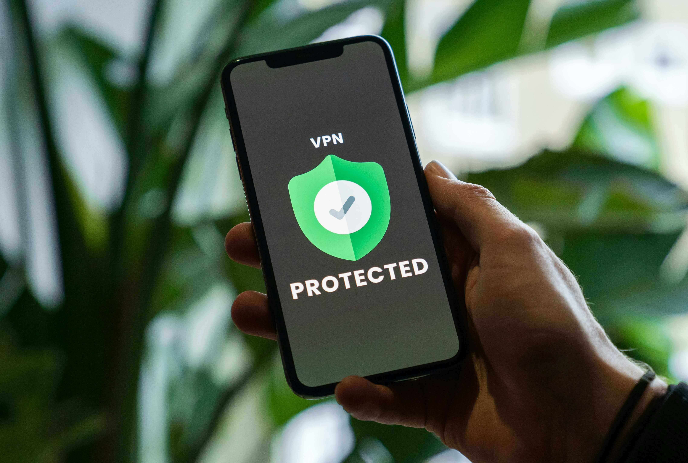

# VPNs Explained: Do You Really Need One?

So, you’ve heard about VPNs. Maybe your tech-savvy friend won’t stop raving about them, or you’ve seen ads claiming they’ll make you “invisible online.” But before you whip out your credit card, let’s talk about what VPNs actually do—and what they *don’t* do. Spoiler alert: they’re not magic.

---

## What’s a VPN? (And What’s It Not?)

A VPN, or **Virtual Private Network**, is like a secret tunnel for your Internet traffic. It encrypts your connection and routes it through a server somewhere else in the world. This hides your real IP address and makes it harder for snoops to see what you’re up to.

But here’s the thing: VPNs aren’t a one-size-fits-all solution. They’re not going to turn you into a digital ninja or solve all your online problems. Let’s bust some myths:

### What VPNs *Don’t* Do
- **Make you anonymous**: Nope. You’re not suddenly Jason Bourne.
- **Protect your passwords**: If you use “password123,” a VPN won’t save you.
- **Hide your GPS location**: Your phone’s GPS is a separate beast.
- **Stop data breaches**: If a website gets hacked, a VPN won’t help.
- **Prevent social media tracking**: Facebook and Google will still stalk you.
- **Defend against all hackers**: A VPN won’t stop you from clicking on phishing links.

In short, VPNs aren’t a magic shield. They’re more like a lock on your front door—useful, but not foolproof.

---

## What VPNs *Actually* Do

Now that we’ve cleared up what VPNs *aren’t*, let’s talk about what they *are* good for:

### 1. Hide Your IP Address
Your IP address is like your online home address. A VPN masks it, so websites and services can’t see where you’re really browsing from. This also stops your ISP (Internet Service Provider) from tracking the sites you visit.

### 2. Protect You on Public Wi-Fi
Public Wi-Fi at airports, cafes, and hotels is like a playground for hackers. A VPN encrypts your connection, making it much harder for them to snoop on your data.

### 3. Bypass Censorship and Geo-Blocks
Some countries block certain websites or services. A VPN can help you access them by making it look like you’re browsing from somewhere else. It’s also great for streaming shows that aren’t available in your region.

---

## The Catch: Trust Matters

Here’s the big caveat: when you use a VPN, *all your Internet traffic goes through their servers*. That means the VPN provider could technically see everything you do online.

So, if you’re using a sketchy VPN, you’re just swapping one snoop (your ISP) for another (the VPN). That’s why it’s crucial to choose a trustworthy provider with a **no-logs policy**—meaning they don’t keep records of your activity.

---

## Do You Really Need a VPN?

Ask yourself these questions:
- Do you often use public Wi-Fi?
- Do you want to hide your browsing from your ISP?
- Do you need to access geo-blocked content or bypass censorship?

If you answered “yes” to any of these, a VPN might be worth it. If not, you can probably save your money.

---

## VPN Recommendations

If you’ve decided you need a VPN, here are some trusted options:

### Most Affordable & Feature-Packed
- **Windscribe**: Their “Build A Plan” option lets you customize your subscription.

### Most Popular
- **Mullvad VPN**: Known for its transparency and strong privacy features.
- **IVPN**: Another solid choice for privacy-conscious users.

### Has a Free Tier
- **Proton VPN**: Offers a free plan and integrates with Proton’s suite of privacy apps (Mail, Drive, Calendar, etc.).

All of these providers offer open-source clients and have been independently audited to prove their no-logs claims. For a detailed comparison, check out **Techlore’s VPN Toolkit**.

---

## A Word on Free VPNs

Free VPNs are like free puppies—they might seem like a good idea at first, but they often come with hidden costs. Most free VPNs make money by selling your data, which defeats the whole purpose of using one. The only exception is **Proton VPN**, which offers a legit free tier.

---

## The Bottom Line

VPNs are a useful tool, but they’re not a cure-all for every online problem. If you need to protect your privacy on public Wi-Fi, hide your IP address, or bypass censorship, a trustworthy VPN is a great option. Just remember: not all VPNs are created equal. Choose wisely, and don’t fall for flashy ads promising the impossible.

Now go forth and browse safely—your Internet traffic deserves a little privacy.
