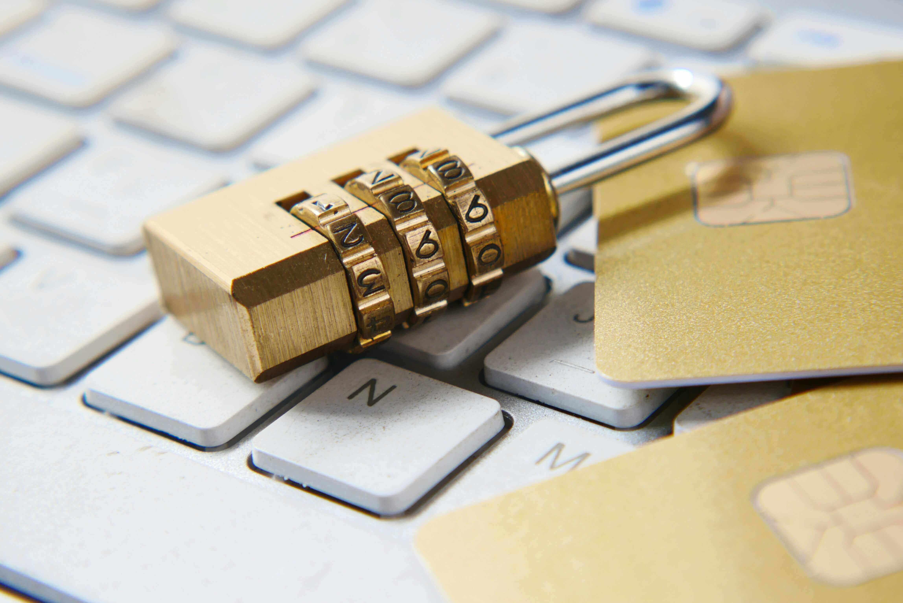

# Privacy vs. Security: The Eternal Battle Between "None of Your Business" and "Trust Me, Bro"

Ah, privacy and security. Two words that get thrown around so much these days, you’d think they were competing for the title of "Most Likely to Be Misunderstood at a Tech Conference." But while they might sound like they’re on the same team—like Batman and Robin, or peanut butter and jelly—they’re actually more like siblings who constantly argue over who gets the last slice of pizza. Let’s break it down, Cracked-style.

---

## **Privacy: "None of Your Business, Karen."**

Privacy is the cool, aloof cousin who shows up to family gatherings wearing sunglasses indoors. It’s all about control—specifically, controlling who gets to know what about you. Privacy is the reason you close the bathroom door even though you live alone. It’s the reason you whisper your Wi-Fi password to your friend instead of shouting it across the room like a maniac. It’s the reason you clear your browser history after Googling "why does my cat stare at me like it’s planning my demise?"

In the digital world, privacy is your right to say, "Hey, Facebook, maybe don’t sell my embarrassing high school photos to advertisers who will then haunt me with ads for acne cream." It’s about keeping your personal life personal. But here’s the kicker: privacy doesn’t care if your information is safe. It just cares that no one’s snooping. You could store your diary in a shoebox under your bed, and as long as no one reads it, your privacy is intact. Even if the shoebox is flammable and sitting next to a space heater.

---

## **Security: "Trust Me, Bro, I Got This."**

Security, on the other hand, is the overprotective older sibling who insists on walking you to school even though you’re 35. It’s not about keeping things secret; it’s about keeping things safe. Security is the reason you lock your doors at night, even though you live in a neighborhood where the biggest crime is someone stealing your Amazon package. It’s the reason you use a password manager instead of writing all your passwords on a sticky note labeled "PASSWORDS (DO NOT LOSE)."

In the digital realm, security is what keeps hackers from turning your life into a dumpster fire. It’s the encryption on your messages, the firewalls on your network, and the two-factor authentication that makes you jump through hoops just to check your email. Security doesn’t care if someone knows you exist—it just cares that they can’t steal your identity, drain your bank account, or post cringe-worthy tweets from your account.

---

## **The Eternal Tug-of-War**

Here’s where things get messy. Privacy and security are often at odds, like two roommates fighting over the thermostat. For example, let’s say the government wants to install surveillance cameras everywhere to "keep you safe." Great for security, right? But what about your privacy? Do you really want Big Brother watching you pick your nose in traffic?

On the flip side, let’s say you decide to go full hermit and live off the grid in a cabin in the woods. Your privacy is through the roof, but your security is nonexistent. One bear attack, and you’re toast. (Literally, if the bear has a taste for humans.)

---

## **The Takeaway**

So, what’s the difference between privacy and security? Privacy is about keeping your business to yourself, while security is about making sure no one messes with your business. They’re like two sides of the same coin, except the coin is your life, and dropping it could mean disaster.

In an ideal world, we’d have both: a digital utopia where no one knows your secrets, and no one can steal them either. But until then, we’ll just have to keep juggling the two, like a circus performer trying to balance a chainsaw on their nose while riding a unicycle. Good luck out there, folks. And maybe don’t Google that thing about your cat. Just in case.
